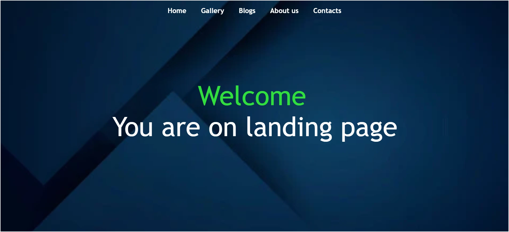
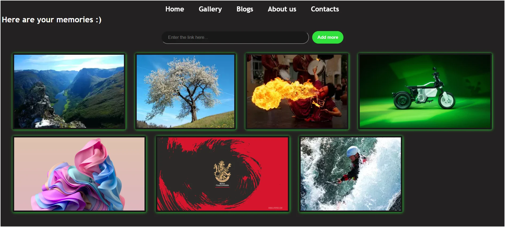
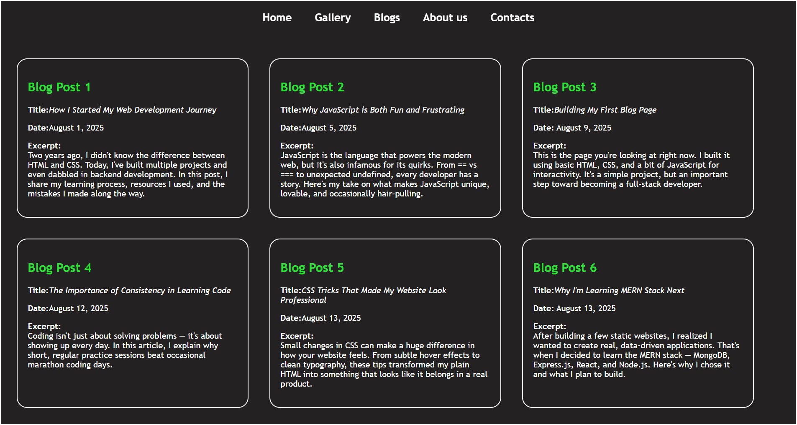

# Simple Personal Website

This is a simple personal website project built using **HTML**, **CSS**, and **JavaScript**. It features a landing page, about section, contact section, gallery, and blog page. The navigation bar is loaded dynamically on each page for consistency.

## Screenshots 📷







## Features

- **Landing Page:** Welcome message with a background image.
- **About Us:** Brief description about the site or owner.
- **Contacts:** Email, phone, and social media links.
- **Gallery:** View images and add new images by URL.
- **Blogs:** Multiple blog posts displayed in a card layout.
- **Dynamic Navbar:** Shared navigation bar loaded via JavaScript.

## How to Run

1. Clone or download this repository.
2. Open `index.html` in your web browser.
3. Navigate between pages using the navbar.

## Folder Structure

```
WT-hw/
├── assets/
│   └── ... (images)
├── index.html
├── gallery.html
├── blog.html
├── index.css
├── index.js
├── navbar.html
└── readme.md
```